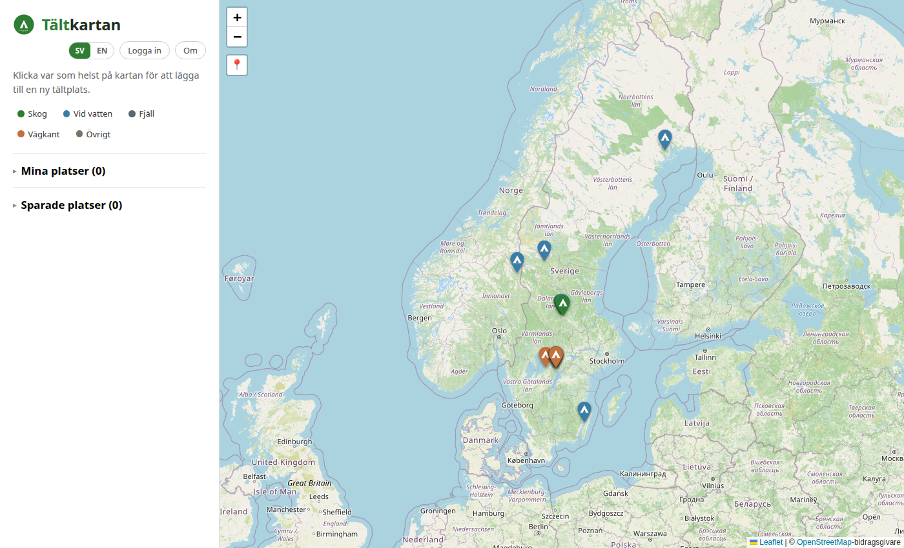

# Tältkartan (The Tent Map)

**Live site: [campingspots.vercel.app](https://campingspots.vercel.app/)** (Takes 30 seconds to wake up server)

A full-stack web app for finding and sharing free, wild tent camping spots in Swedish nature — under *allemansrätten* ("the right to roam"), Sweden's legal right to access and camp on most land for free. Think of it as a crowdsourced map for wild camping: users drop a pin, tag the terrain type, and everyone else can see it, save it, or flag it if something's wrong.



## What it does

- **Interactive map** (Leaflet/OpenStreetMap) of user-submitted tent spots across Sweden, color-coded by terrain type (forest, waterside, mountain, roadside, other).
- **Accounts & authorship** — sign up, and every spot you add is attributed to your chosen username. Edit or delete your own spots; everyone else's stay visible but read-only to you.
- **Save & report** — bookmark spots you like to a personal "Saved places" list, or flag a spot as incorrect/unsafe. Reporting is capped at once per person per spot to keep it useful instead of spammy.
- **Moderation** — admins get a dedicated view of every reported spot (reason, comment, who reported it) and can dismiss the reports or remove the spot.
- **Bilingual** — full Swedish/English UI, switchable at any time, including all error messages.
- **Mobile-friendly** — responsive layout that adapts from a wide desktop map view down to a single-column phone layout.

## Tech stack

**Frontend** — React 18, TypeScript, Vite, React-Leaflet, hand-rolled i18n (no external library), deployed on Vercel.

**Backend** — Node.js, Express, TypeScript, Drizzle ORM, deployed on Render.

**Data & auth** — Postgres + Supabase Auth (email/password, JWT verification via JWKS), Row Level Security-compatible schema with the backend connecting directly via Postgres for full control over authorization logic.

**Infra notes** — client and server are independently deployable (Vercel + Render), talking over a plain REST API, so a future native/mobile client could reuse the same backend without changes.

## Project structure

```
client/   React + Vite frontend
server/   Express API + Drizzle schema/migrations
```

Each has its own `package.json`; the root `npm run dev` runs both concurrently for local development.

## Running locally

Requires Node 22+ and a Supabase project (Postgres + Auth).

```bash
npm install --prefix client
npm install --prefix server
# copy server/.env.example to server/.env and client/.env.example to client/.env,
# fill in your Supabase project's connection string, URL, and keys
npm run db:migrate --prefix server
npm run dev
```

This starts the API on `http://localhost:3001` and the client on `http://localhost:5173`.
